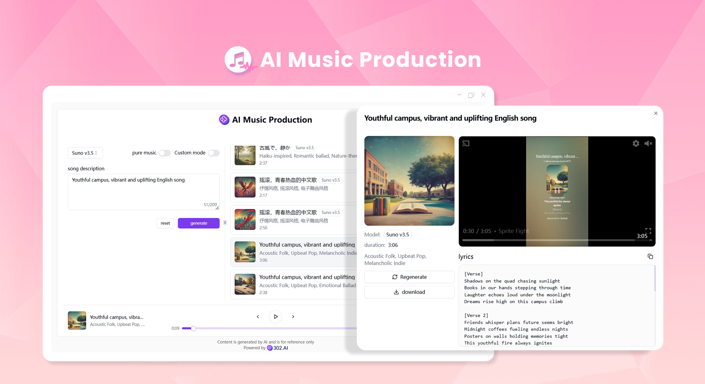
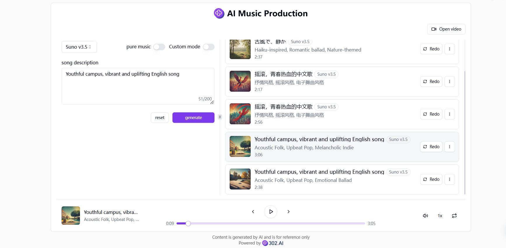
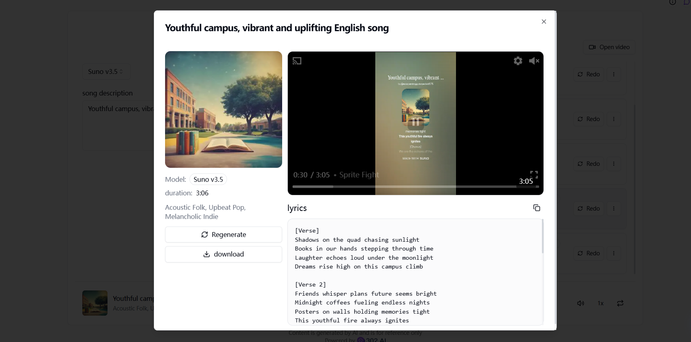

# <p align="center"> 🎼 AI Music Production 🚀✨</p>

<p align="center">AI music production uses the services of Suno.ai and Udio.com to create high-quality music works, and also provides the functions of generating lyrics and videos.</p>

<p align="center"><a href="https://302.ai/en/tools/music/" target="blank"></a></p >

<p align="center"><a href="README_zh.md">中文</a> | <a href="README.md">English</a> | <a href="README_ja.md">日本語</a></p>



This is the open-source version of the [AI Music Production](https://302.ai/en/tools/music/) from [302.AI](https://302.ai/en/). You can directly log in to 302.AI to use the online version with zero code and zero background, or modify and deploy it yourself according to your requirements.


## Interface Preview
According to the description of the input song, combined with the selected model, high-quality music works can be produced.


The function of generating lyrics is provided. To generate videos, the Suno model needs to be selected.



## Project Features
### 🎼 Create a Song
Enter the description of the song in the input box on the creation page. You can choose whether it's pure music or not. After clicking the creation button, the generated music will be fully displayed in the play list.
### 📝 Customization Mode
You can customize the lyrics, style and title. The AI will generate a piece of music according to your lyrics.
### 🎤 Lyric Generation
You can randomly generate lyrics or enter some words before generating lyrics. The AI will generate lyrics by associating with the keywords you input.
### 🎥 Video Generation
The Suno model can generate not only audio but also video.
### 🌓 Dark Mode
It supports dark mode to protect your eyes.
### 🌍 Multi-language Support
- Chinese Interface
- English Interface
- Japanese Interface

## 🚩 Future Update Plans
- [ ] A new sound effect function has been added
- [ ] A new history record function has been added, allowing users to import music from the history records for creation


## 🛠️ Tech Stack

- **Framework**: Next.js 14
- **Language**: TypeScript
- **Styling**: TailwindCSS
- **UI Components**: Radix UI
- **State Management**: Jotai
- **Form Handling**: React Hook Form
- **HTTP Client**: ky
- **i18n**: next-intl
- **Theming**: next-themes
- **Code Standards**: ESLint, Prettier
- **Commit Standards**: Husky, Commitlint

## Development & Deployment
1. Clone the project
```bash
git clone https://github.com/302ai/302_music_generator
cd 302_music_generator
```

2. Install dependencies
```bash
pnpm install
```

3. Configure environment
```bash
cp .env.example .env.local
```
Modify the environment variables in `.env.local` as needed.

4. Start development server
```bash
pnpm dev
```

5. Build for production
```bash
pnpm build
pnpm start
```


## ✨ About 302.AI ✨
[302.AI](https://302.ai) is an enterprise-oriented AI application platform that offers pay-as-you-go services, ready-to-use solutions, and an open-source ecosystem.✨
1. 🧠 Comprehensive AI capabilities: Incorporates the latest in language, image, audio, and video models from leading AI brands.
2. 🚀 Advanced application development: We build genuine AI products, not just simple chatbots.
3. 💰 No monthly fees: All features are pay-per-use, fully accessible, ensuring low entry barriers with high potential.
4. 🛠 Powerful admin dashboard: Designed for teams and SMEs - managed by one, used by many.
5. 🔗 API access for all AI features: All tools are open-source and customizable (in progress).
6. 💡 Powerful development team: Launching 2-3 new applications weekly with daily product updates. Interested developers are welcome to contact us.
