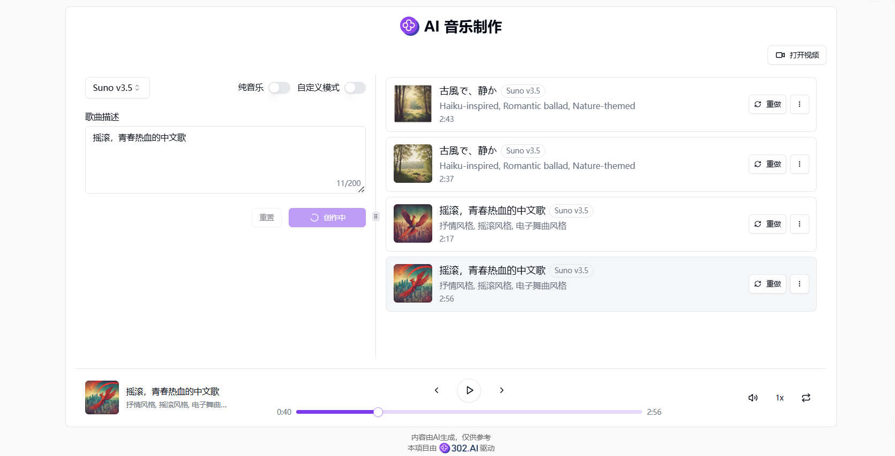
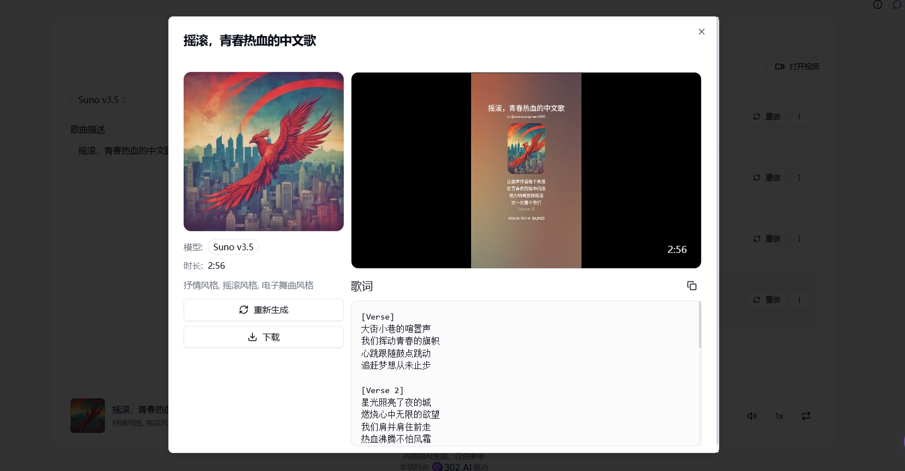

# <p align="center"> 🎼 AI 音乐制作 🚀✨</p>

<p align="center">AI音乐制作使用Suno.ai和Udio.com的服务制作高质量的音乐作品，并且提供生成歌词和视频的功能。</p>

<p align="center"><a href="https://302.ai/tools/music/" target="blank"></a></p >

<p align="center"><a href="README_zh.md">中文</a> | <a href="README.md">English</a> | <a href="README_ja.md">日本語</a></p>


来自[302.AI](https://302.ai)的[AI音乐制作](https://302.ai/tools/music/)的开源版本。你可以直接登录302.AI，零代码零配置使用在线版本。或者对本项目根据自己的需求进行修改，传入302.AI的API KEY，自行部署。

## 界面预览
根据输入的歌曲描述，结合选择的模型，即可制作高质量的音乐作品。


提供生成歌词的功能，生成视频需要选择Suno模型。


## 项目特性
### 🎼 创作歌曲
  在创作页面的输入框中输入歌曲描述，可选择是否为纯音乐，点击创作按钮后，生成的音乐会在播放列表展示完整。
### 📝 自定义模式
  可自定义歌词、风格和标题，AI会根据你的歌词生成一首音乐。
### 🎤 歌词生成
  可以随机生成歌词，或者输入一下文字再生成歌词，AI会根据你输入的关键词进行联想生成歌词。
### 🎥 视频生成
  Suno模型不仅可以生成音频还可以生成视频。
### 🌓 暗色模式
  支持暗色模式，保护您的眼睛。
### 🌍 多语言支持
  - 中文界面
  - English Interface
  - 日本語インターフェース

## 🚩 未来更新计划
- [ ] 新增音效功能
- [ ] 新增历史记录功能，允许用户从历史记录中导入音乐进行创作


## 🛠️ 技术栈

- **框架**: Next.js 14
- **语言**: TypeScript
- **样式**: TailwindCSS
- **UI组件**: Radix UI
- **状态管理**: Jotai
- **表单处理**: React Hook Form
- **HTTP客户端**: ky
- **国际化**: next-intl
- **主题**: next-themes
- **代码规范**: ESLint, Prettier
- **提交规范**: Husky, Commitlint


## 开发&部署
1. 克隆项目
```bash
git clone https://github.com/302ai/302_music_generator
cd 302_music_generator
```

2. 安装依赖
```bash
pnpm install
```

3. 环境配置
```bash
cp .env.example .env.local
```
根据需要修改 `.env.local` 中的环境变量。

4. 启动开发服务器
```bash
pnpm dev
```

5. 构建生产版本
```bash
pnpm build
pnpm start
```


## ✨ 302.AI介绍 ✨
[302.AI](https://302.ai)是一个面向企业的AI应用平台，按需付费，开箱即用，开源生态。✨
1. 🧠 集合了最新最全的AI能力和品牌，包括但不限于语言模型、图像模型、声音模型、视频模型。
2. 🚀 在基础模型上进行深度应用开发，我们开发真正的AI产品，而不是简单的对话机器人
3. 💰 零月费，所有功能按需付费，全面开放，做到真正的门槛低，上限高。
4. 🛠 功能强大的管理后台，面向团队和中小企业，一人管理，多人使用。
5. 🔗 所有AI能力均提供API接入，所有工具开源可自行定制（进行中）。
6. 💡 强大的开发团队，每周推出2-3个新应用，产品每日更新。有兴趣加入的开发者也欢迎联系我们
